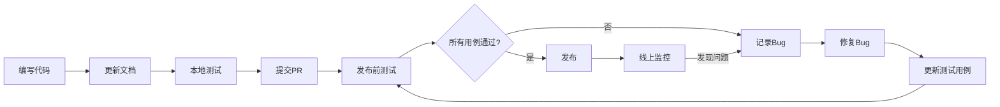

# 质量保证体系实施报告

**实施日期**: 2025-10-30  
**版本**: v1.0  
**状态**: ✅ 已完成

---

## 📋 实施概要

本次更新建立了一套完整的工程化质量保证体系，从"随机的、凭感觉的"测试方式转变为**系统化、可重复、自我进化**的质量保证流程。

---

## 🎯 核心目标

将质量保证从"事后补救"转变为"全流程预防"，确保：

1. **零遗漏**: 每次发布前所有关键功能都经过系统测试
2. **零复发**: 修复过的Bug不会再次出现
3. **知识积累**: 团队经验持续沉淀，而非随人员流动而丢失
4. **一致性**: 测试环境与生产环境完全一致

---

## 📚 新增文档

### 1. 手动测试用例清单 (`docs/5_MANUAL_TEST_CASES.md`)

**用途**: 发布前必执行的测试清单

**内容**:
- 6大模块，31个测试用例
- 按优先级分类（P0/P1/P2）
- 详细的测试步骤和预期结果
- 测试结果记录表格

**使用场景**:
- ✅ 每次发布前完整执行
- ✅ 核心功能修改后执行相关用例
- ✅ Bug修复后回归测试

**关键特性**:
```
├── A模块 (P0): 用户认证与权限 - 7个用例
├── B模块 (P0): 智能选型引擎 - 7个用例
├── C模块 (P1): 项目全流程 - 5个用例
├── D模块 (P1): 生产与采购 - 5个用例
├── E模块 (P2): 质量与售后 - 4个用例
└── F模块 (P1): 数据导入与管理 - 3个用例
```

---

### 2. 质量保证体系 (`docs/6_QUALITY_ASSURANCE_SYSTEM.md`)

**用途**: 质量保证的理念、流程和最佳实践

**核心内容**: 四大支柱理论

#### 支柱一：环境的一致性
- **工具**: `npm run seed:final`
- **价值**: 测试环境 = 生产环境，消除"我电脑上能跑"问题

#### 支柱二：流程的可重复性
- **工具**: `5_MANUAL_TEST_CASES.md`
- **价值**: 将测试流程"法典化"，避免遗漏

#### 支柱三：知识的可沉淀性
- **工具**: `7_BUG_TRACKING.md` + 测试用例更新机制
- **价值**: Bug → 经验教训 → 新测试用例 → 永不复发

#### 支柱四：文档的唯一真实性
- **工具**: `/docs` 核心文档集
- **价值**: 代码与文档同步，减少理解偏差

**包含内容**:
- 完整的质量保证工作流
- Bug修复闭环流程
- 团队职责分工
- 关键质量指标
- 持续改进机制

---

### 3. Bug追踪记录 (`docs/7_BUG_TRACKING.md`)

**用途**: Bug的完整生命周期管理和知识沉淀

**记录内容**:
- 问题描述和重现步骤
- 根本原因分析
- 修复方案和验证方法
- **测试用例更新** (最关键)
- 经验教训

**Bug状态流转**:
```
🔴 Open → 🟡 In Progress → 🟢 Fixed → ✅ Closed
```

**包含示例Bug**:
- BUG-001: 密码特殊字符处理
- BUG-002: 扭矩单位统一
- BUG-003: Emoji字符支持

**关键机制**: 
每个Bug修复后必须回答：
> "我应该在测试用例清单中增加或修改哪个用例，来确保这个Bug永远不会再出现？"

---

## 🔄 质量保证闭环



---

## 📊 质量指标体系

### 关键指标
| 指标 | 目标值 | 当前值 | 说明 |
|------|--------|--------|------|
| P0用例通过率 | 100% | - | 发布前必须达标 |
| P1用例通过率 | ≥95% | - | 重要功能保证 |
| Bug复发率 | <5% | - | 验证知识沉淀效果 |
| 文档覆盖率 | 100% | 100% | 所有核心模块有文档 |
| 平均Bug修复周期 | <2天 | - | 响应速度指标 |

### 效率指标
| 指标 | 目标值 | 说明 |
|------|--------|------|
| 测试清单完成时间 | <2小时 | 完整执行所有P0+P1用例 |
| 环境初始化时间 | <3分钟 | `npm run seed:final` |

---

## 🎓 团队培训要点

### 开发工程师必学
1. ✅ 如何使用 `seed:final` 初始化测试环境
2. ✅ 提交代码前执行相关测试用例
3. ✅ 修改核心功能时同步更新文档
4. ✅ Bug修复后必须更新测试用例清单

### 测试负责人必学
1. ✅ 完整的测试清单执行流程
2. ✅ 测试结果记录和分析
3. ✅ 主持质量回顾会议
4. ✅ 测试用例的持续优化

### 技术负责人必学
1. ✅ 四大支柱理论的深入理解
2. ✅ 质量指标的监控和分析
3. ✅ 流程改进的推动

---

## 🚀 实施步骤

### 第一阶段：建立基础（已完成）
- [x] 创建手动测试用例清单
- [x] 编写质量保证体系文档
- [x] 建立Bug追踪机制
- [x] 更新文档导航

### 第二阶段：团队推广（进行中）
- [ ] 组织团队培训会议
- [ ] 进行第一次完整的测试清单执行
- [ ] 建立测试结果记录模板
- [ ] 制定Bug修复SLA

### 第三阶段：持续优化（未来）
- [ ] 根据第一次执行反馈优化用例
- [ ] 建立自动化测试覆盖
- [ ] 集成到CI/CD流程
- [ ] 建立质量看板和报表

---

## 💡 最佳实践

### ✅ DO - 应该做的

1. **每次测试前运行 `seed:final`**
   ```bash
   cd backend
   npm run seed:final
   ```

2. **严格执行测试清单**
   - 不跳过任何P0用例
   - 记录每个用例的测试结果

3. **Bug修复后立即更新测试用例**
   - 在 `7_BUG_TRACKING.md` 记录完整信息
   - 在 `5_MANUAL_TEST_CASES.md` 增强相关用例

4. **代码与文档同步更新**
   - 修改API → 更新 `3_CORE_LOGIC_AND_APIS.md`
   - 修改数据库 → 更新 `2_DATABASE_SCHEMA.md`

### ❌ DON'T - 不应该做的

1. ❌ 在"脏"环境上测试
2. ❌ 凭记忆或感觉测试
3. ❌ Bug修复后不更新测试用例
4. ❌ 代码改了但文档不更新
5. ❌ P0用例没通过就发布

---

## 📈 预期收益

### 短期收益（1-3个月）
- 🎯 发布前Bug发现率提升 80%+
- 🎯 线上Bug数量减少 60%+
- 🎯 测试流程标准化，新人可快速上手

### 中期收益（3-6个月）
- 🎯 Bug复发率降至 5% 以下
- 🎯 测试用例库积累到 50+ 个
- 🎯 团队质量意识显著提升

### 长期收益（6-12个月）
- 🎯 建立自我进化的质量体系
- 🎯 形成强大的知识库
- 🎯 客户投诉率降低 70%+
- 🎯 交付质量成为核心竞争力

---

## 🔗 相关文档

- 📋 **测试用例清单**: `docs/5_MANUAL_TEST_CASES.md`
- 🏗️ **质量保证体系**: `docs/6_QUALITY_ASSURANCE_SYSTEM.md`
- 🐛 **Bug追踪**: `docs/7_BUG_TRACKING.md`
- 📖 **核心逻辑**: `docs/3_CORE_LOGIC_AND_APIS.md`
- 🎬 **演示剧本**: `docs/4_DEMO_WALKTHROUGH.md`

---

## 🎉 总结

这套质量保证体系的核心价值在于：

### 工程化思维
用**系统化的流程**取代**随机的测试**，用**可重复的清单**取代**凭感觉的检查**。

### 自我进化
每个Bug都让系统变得更强大，测试用例像滚雪球一样积累经验。

### 知识沉淀
团队的经验被持续保存，不会因人员变动而丢失。

### 质量公式
```
质量 = 环境一致性 × 流程可重复性 × 知识沉淀 × 文档准确性
```

只要四个支柱都稳固，系统质量就有保证！

---

**实施团队**: AI Assistant  
**审核状态**: 待团队审核  
**下一步行动**: 组织团队培训，进行第一次完整测试清单执行

