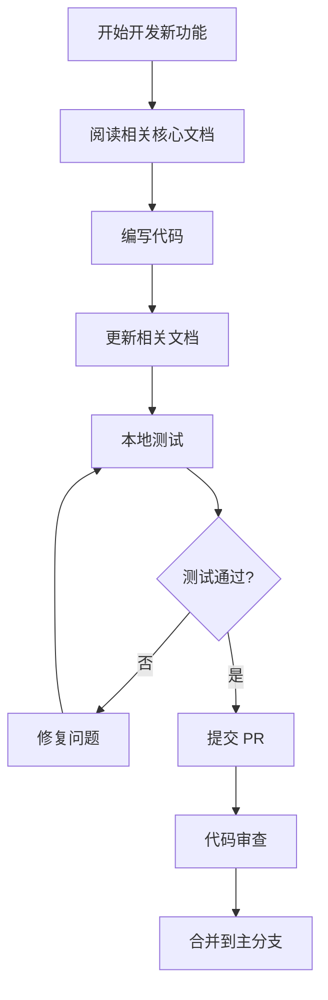
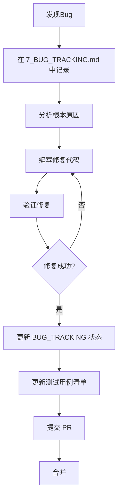

# Project Ark - 质量保证体系 (Quality Assurance System)

## 核心理念

我们的成功关键在于：用**"工程化的思维"取代了"随机的、凭感觉的"**测试。

这不是一套简单的测试流程，而是一个**自我进化、持续加强的质量保证闭环系统**。

---

## 四大支柱 (The Four Pillars)

### 支柱一：环境的一致性 (The Consistent Environment)

#### 问题根源
很多团队的测试环境和线上环境是脱节的。测试环境可能残留着各种"脏数据"或特殊配置，导致问题被掩盖。

#### 我们的解决方案
**`npm run seed:final`** (生产级初始化脚本)

#### 作用
这是您手中最重要的工具。它不仅仅是"演示脚本"，更是您**"线上环境的模拟器"**。

- 每次测试前都运行它，就等于是在一个与全新线上服务器完全一致的、干净的数据库上进行测试
- 消除了"我电脑上能跑"的问题
- 提供标准化的测试账号和基础数据

#### 保证
在这个干净环境里测出来并通过的功能，在线上部署时，行为表现将是**完全一致的**。这就从根源上杜绝了因"环境差异"导致的问题。

#### 实践要求
```bash
# 每次开始测试前必须执行
cd backend
npm run seed:final
```

---

### 支柱二：流程的可重复性 (The Repeatable Process)

#### 问题根源
凭记忆或感觉进行测试，总会遗漏某些角落。今天记得测"故障关"，明天可能就忘了。

#### 我们的解决方案
**`docs/5_MANUAL_TEST_CASES.md`** (手动测试用例清单)

#### 作用
这份清单将测试流程**"法典化"**。它强迫每一个测试人员，在每一次发布前，都必须像飞行员起飞前检查仪表盘一样，系统性地、无遗漏地检查所有关键功能点。

#### 保证
只要严格执行清单，就不会因为"忘了测"而导致问题溜到线上去。

#### 实践要求
1. **P0 级别用例**: 发布前必须 100% 通过
2. **P1 级别用例**: 发布前应当 100% 通过
3. **P2 级别用例**: 重大版本发布前执行

#### 测试清单结构
- **A 模块** (P0): 用户认证与权限 - 7个用例
- **B 模块** (P0): 智能选型引擎 - 7个用例  
- **C 模块** (P1): 项目全流程 - 5个用例
- **D 模块** (P1): 生产与采购 - 5个用例
- **E 模块** (P2): 质量与售后 - 4个用例
- **F 模块** (P1): 数据导入与管理 - 3个用例

---

### 支柱三：知识的可沉淀性 (The Accumulated Knowledge)

#### 问题根源
Bug被修复了，但修复这个Bug所获得的"经验教训"却丢失了。下一次有人不小心改动了相关代码，同样的问题可能再次出现。

#### 我们的解决方案
**`docs/7_BUG_TRACKING.md`** + **持续更新的测试用例**

#### 作用

##### 1. Bug跟踪
`7_BUG_TRACKING.md` 记录了每一个错误的"尸检报告"，包括：
- Bug 的表现症状
- 根本原因分析
- 修复方案
- 影响范围
- 修复验证方法

##### 2. 用例升级 (最关键的一步)
当一个Bug被修复后，您必须问一个问题：

> **"我应该在 `5_MANUAL_TEST_CASES.md` 中增加或修改哪个测试用例，来确保这个Bug永远不会再出现？"**

#### 实践示例

**Bug生命周期闭环：**

1. **发现Bug**: "当项目名称包含表情符号时，列表页崩溃。" 
   - 记录为 `BUG-003` in `7_BUG_TRACKING.md`

2. **修复Bug**: 后端增加了对特殊字符的处理
   - 提交代码，附带 `Fixes BUG-003` 标签

3. **沉淀经验**: 在 `5_MANUAL_TEST_CASES.md` 中更新测试用例
   ```markdown
   | C-01 | **销售-创建项目** | 
   1. 销售经理登录。
   2. 创建项目，项目名称包含特殊字符 (如 &、%、emoji 🚀)。
   3. 指派技术工程师。 | 
   ① 项目创建成功，特殊字符被正确处理或转义。
   ② 项目列表页正常显示，无崩溃。 |
   ```

4. **验证闭环**: 下次执行 `C-01` 测试时，自动验证该Bug不会复发

#### 保证
通过这个闭环，您团队犯过的每一个错误，都会变成未来质量保障体系的一部分。这使得您的测试清单**越来越强大**，像滚雪球一样积累经验，从而系统性地防止了错误的"二次复发"。

---

### 支柱四：文档的唯一真实性 (The Single Source of Truth)

#### 问题根源
当代码和文档脱节时，新的开发者可能会基于错误的理解去修改功能，从而引入新的Bug。

#### 我们的解决方案
**精简的核心文档集 (`/docs`)**

#### 文档结构

```
docs/
├── 1_README.md                    # 系统总览与快速开始
├── 2_DATABASE_SCHEMA.md           # 数据库架构设计
├── 3_CORE_LOGIC_AND_APIS.md       # 核心业务逻辑与API
├── 4_DEMO_WALKTHROUGH.md          # 标准产品演示剧本
├── 5_MANUAL_TEST_CASES.md         # 手动测试用例清单
├── 6_QUALITY_ASSURANCE_SYSTEM.md  # 质量保证体系 (本文档)
└── 7_BUG_TRACKING.md              # Bug追踪与修复记录
```

#### 作用
当开发者需要修改核心功能（如选型算法）时，他会被流程强制要求先阅读 `3_CORE_LOGIC_AND_APIS.md`。这确保了他是在充分理解现有设计的基础上进行修改，而不是"盲人摸象"。

#### 文档维护原则

1. **代码变更 → 文档必须同步更新**
   - 修改选型算法 → 更新 `3_CORE_LOGIC_AND_APIS.md`
   - 添加新接口 → 更新 `3_CORE_LOGIC_AND_APIS.md`
   - 修改数据库结构 → 更新 `2_DATABASE_SCHEMA.md`

2. **文档审查机制**
   - PR 必须包含相关文档的更新
   - 定期运行 `check_docs_freshness.js` 检查文档健康度

3. **文档即规范**
   - 当文档与代码不一致时，优先相信文档
   - 如果文档错误，先修复文档，再修复代码

#### 保证
这最大限度地减少了因"信息不一致"或"理解偏差"而引入新问题的风险。

---

## 完整的质量保证工作流 (QA Workflow)

### 日常开发流程



### Bug修复流程



### 发布前质量检查流程

```bash
# 1. 环境准备
cd backend
npm run seed:final

# 2. 执行手动测试清单
# 打开 docs/5_MANUAL_TEST_CASES.md
# 逐项执行所有 P0 和 P1 级别用例

# 3. 记录测试结果
# 在测试清单中标记每个用例的通过/失败状态

# 4. 决策
# - 如果所有 P0 用例通过，且 P1 用例通过率 ≥ 95% → 批准发布
# - 否则 → 修复失败的用例，重新测试
```

---

## 关键指标 (Key Metrics)

### 质量指标
- **P0 用例通过率**: 必须 100%
- **P1 用例通过率**: 目标 ≥ 95%
- **Bug 复发率**: 目标 < 5%
- **文档覆盖率**: 所有核心模块必须有文档

### 效率指标
- **测试清单完成时间**: 目标 < 2 小时
- **环境初始化时间**: < 3 分钟
- **Bug 修复周期**: 平均 < 2 天

---

## 持续改进机制

### 每月质量回顾会议
1. **回顾本月所有Bug**
   - 分析 Bug 类型分布
   - 识别高频问题领域

2. **评估测试清单有效性**
   - 哪些Bug本应该被测试清单发现但没有？
   - 需要增加哪些新的测试用例？

3. **优化流程**
   - 识别效率瓶颈
   - 讨论自动化机会

### 测试清单进化
```markdown
# 示例：测试清单版本历史

v1.0 (2025-10-30)
- 初始版本：31个测试用例

v1.1 (2025-11-15) - 计划
- 新增：B-08 "边界值测试 - 超大管径选型"
- 修改：C-01 增加特殊字符测试 (因 BUG-003)
- 新增：F-04 "导入超大文件 (>10MB)" (因 BUG-007)
```

---

## 团队职责

### 开发工程师
- [ ] 提交代码前，执行相关模块的测试用例
- [ ] 修复Bug后，在 `7_BUG_TRACKING.md` 中更新状态
- [ ] 修改核心功能后，同步更新相关文档

### 测试负责人
- [ ] 每次发布前，完整执行测试清单
- [ ] 记录并分析测试结果
- [ ] 主持质量回顾会议
- [ ] 维护和优化测试清单

### 技术负责人
- [ ] 审查文档更新的完整性
- [ ] 批准测试清单的修改
- [ ] 定期检查质量指标
- [ ] 推动流程改进

---

## 工具与资源

### 核心脚本
- `backend/seed_final_acceptance.js` - 生产级环境初始化
- `scripts/check_docs_freshness.js` - 文档健康度检查

### 核心文档
- `docs/5_MANUAL_TEST_CASES.md` - 测试用例清单
- `docs/7_BUG_TRACKING.md` - Bug追踪记录
- `docs/3_CORE_LOGIC_AND_APIS.md` - 核心逻辑参考

### 自动化支持
- GitHub Actions: 文档健康度自动检查
- CI/CD: 自动化测试集成（未来规划）

---

## 总结

这套质量保证体系的核心价值在于：

1. **系统性**: 不依赖个人记忆，而是依赖流程和清单
2. **可重复性**: 任何人按照流程执行，都能得到一致的结果
3. **自我进化**: 每个Bug都让系统变得更强大
4. **知识积累**: 团队的经验被持续沉淀，而不会因人员流动而丢失

**记住这个公式：**

```
质量 = 环境一致性 × 流程可重复性 × 知识沉淀 × 文档准确性
```

只要四个支柱都稳固，系统质量就有保证。任何一个支柱薄弱，质量就会出现问题。

